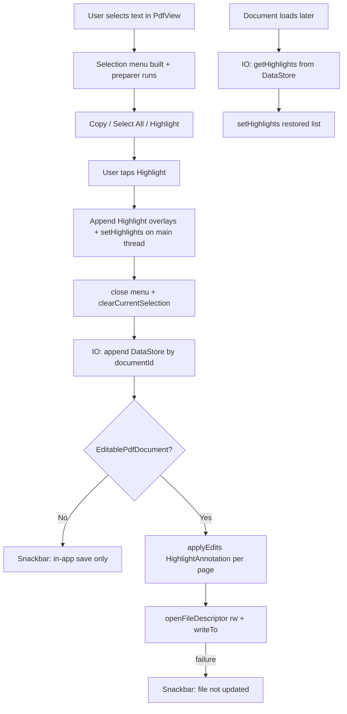

# Highlight feature on Android (`androidPdfReader`)

This document describes how the highlight flow works in the Android module `androidPdfReader`, based on `ReaderPdfSelectionConfigurator.kt`, `PdfHighlightPersistence.kt`, `UserPdfHighlightsRepository.kt`, and `ReaderPdfViewerFragment.kt`.

## Overview

The highlight feature has these main parts:

1. Text selection is handled by AndroidX **`PdfView`** (Jetpack PDF viewer); the app customizes the selection context menu.
2. **`ReaderPdfSelectionConfigurator`** adds a **`Highlight`** action next to **`Copy`** and **`Select All`**, and removes classifier “smart actions” for a consistent menu.
3. Highlights are shown **immediately** via **`PdfView.setHighlights`** (overlay `Highlight` objects with `PdfRect` + color).
4. **Persistence is two-layered**:
   - **App storage (primary for reopening):** rectangles are appended per **`documentId`** in **DataStore** (`UserPrefsUserPdfHighlightsRepository`).
   - **PDF file (when possible):** **`EditablePdfDocument.applyEdits`** inserts real highlight annotations, then **`PdfWriteHandle.writeTo`** writes bytes back to the **`Uri`**—only if **`ContentResolver.openFileDescriptor(uri, "rw")`** succeeds.

5. On document load, saved overlays are **restored** from DataStore and applied with **`setHighlights`** again (never **`runBlocking`** on the main thread for DataStore; that can deadlock).

## Text selection and menu behavior

- **`PdfView`** exposes text selection; the current selection is a **`Selection`**, which for text is **`TextSelection`** (`text` + **`bounds`**: a list of **`PdfRect`**, typically one rect per line).
- The viewer builds default menu items (copy, select all, and optional smart actions from **`TextClassifier`**).
- The app registers a **`PdfView.SelectionMenuItemPreparer`** that:
  - Removes items whose key is **`PdfSelectionMenuKeys.SmartActionKey`**.
  - Appends a **`SelectionMenuComponent`** for **`Highlight`** (custom key object), with label/description from **`strings.xml`**.

The built-in **`PdfViewerFragment`** annotation **toolbox (pen FAB)** is hidden by overriding **`onRequestImmersiveMode`** and **`onLoadDocumentSuccess`** to keep **`isToolboxVisible = false`**, so highlights are driven from the text menu only—not the separate system “annotate” intent flow.

## Applying highlights (immediate feedback)

When the user taps **Highlight**:

1. Read **`pdfView.currentSelection`** as **`TextSelection`** (if not text, only **`close()`** the menu).
2. For each bound in **`selection.bounds`**, append **`Highlight(PdfRect, colorArgb)`** to a **session list** shared with the fragment.
3. Call **`pdfView.setHighlights(sessionHighlights.toList())`** on the **main thread** so the yellow overlay appears in the same gesture.
4. **`close()`** the selection menu session and **`pdfView.clearCurrentSelection()`** so handles disappear; overlay rectangles remain.

Default color is **`PdfHighlightPersistence.DefaultHighlightColorArgb`** (translucent yellow).

## Saving highlights

### A. App-local storage (always attempted in background)

On a **background dispatcher**, after the overlay:

- **`UserPdfHighlightsRepository.appendFromTextSelection(documentId, selection, colorArgb)`** loads the JSON blob from DataStore, appends one JSON object per **`PdfRect`** (page, left, top, right, bottom, color), and writes back.

**`documentId`** matches **`ReaderLaunchRequest.documentId`** (same id used for reading position and recents). It is passed into **`ReaderPdfViewerFragment`** via fragment arguments and into **`AndroidxPdfReaderActivity`** from the reader intent.

This path **does not require** write access to the PDF file, so highlights **survive app restarts** and **read-only URIs** as long as the same logical document id is used.

### B. Writing into the PDF file (best effort)

If **`pdfView.pdfDocument`** is an **`EditablePdfDocument`**:

- **`PdfHighlightPersistence.applyHighlightAndSave`** (on **IO**):
  - Builds **`MutableEditsDraft`**, groups **`selection.bounds`** by **`pageNum`**, and **`insert`s** one **`HighlightAnnotation`** per page with a list of **`RectF`** for that page.
  - Calls **`document.applyEdits(draft.toEditsDraft())`**.
  - Opens **`openFileDescriptor(uri, "rw")`**, then **`createWriteHandle().use { it.writeTo(pfd) }`** to flush the updated PDF to the **`Uri`**.

If the document is not editable, or **`openFileDescriptor`** fails, a **Snackbar** explains that highlights are still saved **in the app** but not necessarily **inside the PDF file**.

The picker uses **`OpenPdfDocumentContract`** (read + write + persistable flags where the system allows), and **`PersistedUriHelper.takePersistableReadWritePermission`** is used when opening files so long-term write is more likely.

## Retrieving highlights when reopening

In **`ReaderPdfViewerFragment.onLoadDocumentSuccess`**:

- A coroutine on **`viewLifecycleOwner.lifecycleScope`** loads **`getHighlights(documentId)`** on **IO** (wrapped in **`runCatching`** so corrupt DataStore data does not crash the reader).
- On success, it **replaces** the in-memory session list, then **`pdfViewRef?.setHighlights(...)`** so previous sessions’ marks reappear.

**Important:** Loading must **not** use **`runBlocking`** on the main thread with DataStore; that previously caused **deadlocks / instant crashes** with no obvious stack trace in Logcat.

## Relationship to the in-process PDF save coordinator

The module also has **`PdfSaveCoordinator`** used by **`ReaderViewModel`** for **reading-position / recent-files** persistence. Highlight **file** writes use **`PdfHighlightPersistence`** and **`EditablePdfDocument`** APIs instead; the coordinator is **not** wired into the highlight path today.

## Caveats and interactions

- **In-document search:** **`PdfViewerFragment`** subscribes to search highlight state and may call **`setHighlights`** for matches, which can **replace** the overlay list managed for user highlights. Using search may clear or conflict with session highlights until merging is implemented.
- **PDF write success** does not remove DataStore entries; **display on reopen** is driven from **DataStore** for consistency when file embedding is unavailable or invisible in the viewer.

## Flow diagram

