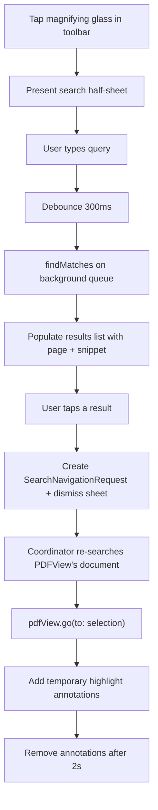
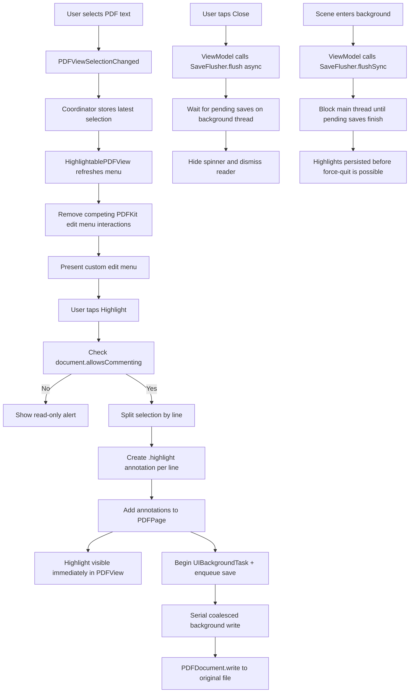

# iOS features

This document describes how key iOS features work in `PDFReaderT`, based on the implementation in `PDFViewer.swift`, `PDFReaderView.swift`, and `PDFReaderViewModel.swift`.

---

# PDF text search

## Overview

The text search feature allows users to find text within the currently opened PDF. Results are shown in a scrollable list inside a half-sheet, and tapping a result navigates the PDF to that location with a temporary yellow highlight annotation that auto-removes after 2 seconds.

## UX flow

1. User taps the **magnifying glass** icon in the **top-left** toolbar (visible only when a PDF is open).
2. A half-sheet slides up with a search text field and results list.
3. As the user types (debounced 300ms), matching results populate the list.
4. Each result row shows the **page number** and a **text snippet** with the matched portion bolded.
5. Tapping a result **dismisses the sheet**, scrolls the PDF to that match, and adds a **temporary yellow highlight annotation** for 2 seconds.

## Architecture

### Model — `PDFSearchResult` and `SearchNavigationRequest`

Located in `DataModel/PDFSearchResult.swift`.

`PDFSearchResult` is an `Identifiable` struct holding:
- `pageIndex` — zero-based page number of the match
- `snippet` — surrounding text for display in the results list
- `matchIndex` — the index of this match in the full search results (used for navigation)
- `selection` — the `PDFSelection` (from the background search document, used only for snippets)

`SearchNavigationRequest` is a lightweight `Equatable` struct passed to `PDFViewer` for navigation:
- `searchText` — the query to re-run against the PDFView's own document
- `matchIndex` — which match to navigate to

The navigation request approach is necessary because `PDFSelection` objects are bound to the `PDFDocument` instance that created them. The background search creates a separate document, so its selections cannot be used directly with the displayed `PDFView`. Instead, the coordinator re-runs the search against the PDFView's live document at navigation time.

### View model additions

`PDFReaderViewModel` gains:
- `@Published var isSearching` — controls sheet presentation
- `@Published var searchText` — bound to the search field
- `@Published var searchResults: [PDFSearchResult]` — populated by search
- `@Published var searchNavigation: SearchNavigationRequest?` — triggers navigation in PDFViewer
- `performSearch()` — cancels any prior debounce task, waits 300ms, then calls `PDFDocument.findString(_:withOptions:)` on a background queue via `findMatches(query:fileURL:)`
- `selectSearchResult(_:)` — creates a `SearchNavigationRequest` with the match index and dismisses the sheet

Search state is fully reset in `performClose()` when the reader is dismissed.

### Search sheet — `PDFSearchSheet`

Located in `PDFReaderView/Helper/PDFSearchSheet.swift`. Presented via `.sheet(isPresented:)` with `.presentationDetents([.medium, .large])`. Contains:
- A search text field with clear button
- A `List` of results with bolded match text via `AttributedString`
- An empty state (`ContentUnavailableView`) when no results match

### PDFViewer navigation — temporary annotation approach

`PDFViewer` accepts `@Binding var searchNavigation: SearchNavigationRequest?`. In `updateUIView`, when non-nil, it delegates to `Coordinator.navigateToSearchResult(_:in:)` and then resets the binding to nil.

The coordinator's `navigateToSearchResult` method:
1. Calls `document.findString(_:withOptions:)` on the **PDFView's own document** to get valid selections.
2. Indexes into the results using `matchIndex`.
3. Calls `pdfView.go(to: selection)` to scroll to the match.
4. Splits the selection by line and creates a **temporary `.highlight` annotation** on each line (yellow, 50% opacity).
5. Tracks these annotations in `temporaryAnnotations`.
6. After **2 seconds**, removes all temporary annotations and refreshes the display.

This approach uses real PDF annotations instead of `PDFView.highlightedSelections` because annotations survive layout changes, scale resets, and view re-renders caused by sheet dismissal animations. The annotations are never saved to disk — they are removed before any save can trigger.

### PDFKit APIs used

- `PDFDocument.findString(_:withOptions:)` — synchronous search returning `[PDFSelection]`
- `PDFSelection.selectionsByLine()` — splits multi-line matches for per-line annotation bounds
- `PDFView.go(to: PDFSelection)` — scroll to match
- `PDFAnnotation(bounds:forType:withProperties:)` — creates temporary highlight annotations
- `PDFPage.addAnnotation(_:)` / `removeAnnotation(_:)` — add/remove the temporary highlights

### Snippet building

`buildSnippet(from:on:maxLength:)` is a `nonisolated static` method that:
1. Gets the full page text via `page.string`
2. Finds the match position within the page text
3. Extracts surrounding context characters (split evenly before/after the match)
4. Adds ellipsis markers if the snippet is truncated

## Interaction with full-screen mode

The search button lives in the toolbar, which is hidden in full-screen mode. The user must exit full screen (single tap) before searching. If the search sheet is already open and the user taps to toggle full screen, the sheet remains independent (it is presented modally).

## Flow diagram

---

# Full-screen mode

## Overview

The full-screen mode lets the user immerse in the PDF by hiding all chrome (navigation bar, status bar, and page counter) with a single tap, and restoring it with another tap.

## Toggling

A `UITapGestureRecognizer` is installed on `HighlightablePDFView`. It is configured so the system's double-tap-to-zoom gesture takes priority (via `gestureRecognizer(_:shouldRequireFailureOf:)`). When the single tap fires, it calls the `onSingleTap` closure on the representable, which invokes `PDFReaderViewModel.toggleFullScreen()`.

The view model exposes `@Published var isFullScreen` (default `false`). The UI model snapshot includes it so the view can react declaratively.

## What changes in full-screen mode

| Element | Normal | Full screen |
|---------|--------|-------------|
| Navigation bar | Visible | Hidden (`.toolbar(.hidden, for: .navigationBar)`) |
| Status bar | Visible | Hidden (`.statusBarHidden(true)`) |
| Page counter | Opaque | Faded out (`opacity(0)`) |

## Layout stability

The `PDFViewer` always applies `.ignoresSafeArea()` regardless of full-screen state. This ensures the underlying `PDFView` frame never changes when the navigation bar appears or disappears, which prevents the PDF from re-fitting its scale and causing a visual blink.

The navigation bar simply overlays on top of the PDF content (with its default material background) when visible, and slides away when hidden.

## Animation

- The navigation bar uses SwiftUI's built-in toolbar hide/show transition.
- The page counter fades with `.animation(.easeInOut(duration: 0.2), value: isFullScreen)`.
- The status bar animates via an `.animation` modifier on the `NavigationStack`.

## Reset on close

`isFullScreen` is reset to `false` inside `performClose()` so the next opened PDF always starts in normal mode.

---

# Highlight feature

## Overview

The highlight feature has four main parts:

1. Detect text selection changes in the PDF view.
2. Present the app's custom edit menu and add a `Highlight` action.
3. Convert the selection into PDF highlight annotations and add them to the in-memory `PDFDocument`.
4. Persist those annotation changes back to the original file using a coalesced background save pipeline, and fully flush pending writes before the reader closes.

## Text selection and menu behavior

When the user long-presses or drags to select text, `PDFViewSelectionChanged` fires. The `PDFViewer.Coordinator` captures the latest `PDFSelection` and tells `HighlightablePDFView` to refresh its menu state.

`HighlightablePDFView` does a few things to make the app's menu win consistently:

- It installs its own `UIEditMenuInteraction`.
- It recursively removes other `UIEditMenuInteraction` instances from PDFKit's internal subviews.
- It returns `false` for the private `_define:` responder action so the system "Look Up / Define" behavior does not take over.
- It presents the menu programmatically after a short delay, and retries a few times if the custom menu does not appear immediately.

The resulting menu is designed to show the normal text actions plus the app's custom `Highlight` action. In practice, the current code appends `Highlight` to UIKit's `suggestedActions`, so the intended user-facing actions are `Copy`, `Select All`, and `Highlight`, but the implementation does not hard-enforce "exactly three actions" as a strict invariant.

## Applying highlights

When the user taps `Highlight`, the view uses the latest active `PDFSelection` and passes it back to the coordinator.

The coordinator then:

1. Checks `document.allowsCommenting`. If the PDF is read-only for annotations, the app shows an alert instead of writing highlights.
2. Splits the selection with `selectionsByLine()`.
3. For each line selection, gets the line bounds on the corresponding `PDFPage`.
4. Creates a `PDFAnnotation` of type `.highlight`.
5. Sets the annotation color to `UIColor.yellow.withAlphaComponent(0.5)`.
6. Adds the annotation directly to the page.

The visual result appears immediately because the annotations are added to the live `PDFDocument` already displayed by `PDFView`. No reload from disk is required for the user to see the highlight.

## Persisting highlights to disk

Saving is handled by a dedicated `PDFSaveCoordinator`.

Its responsibilities are:

- Own a serial background queue.
- Coalesce repeated save requests using `hasPendingSave` and `isSaveRunning`.
- Keep saving logic independent from the UI coordinator, so a long-running file write can continue safely even if the view coordinator is deallocated.

Every highlight creation enqueues a save request. The `save()` method registers a `UIBackgroundTask` before dispatching to the serial queue, so the system knows to keep the app alive for the entire duration the write is queued and executing. On that queue, the coordinator:

1. Starts security-scoped access for the selected file URL.
2. Calls `PDFDocument.write(to:)`.
3. Stops security-scoped access.
4. Ends the background task.
5. If another save request arrived while the write was running, loops again and writes the latest state.

This means rapid highlight edits do not start overlapping writes, and the file eventually converges to the latest annotated document state.

## Flush strategies

The `PDFViewer.Coordinator` registers a `SaveFlusher` with the `PDFReaderViewModel` during setup. The flusher exposes two modes: an async `flush(completion:)` for UI-driven flows and a synchronous `flushSync()` for lifecycle transitions.

### Background-transition flush

When the scene phase changes to `.background`, `PDFReaderViewModel.onDidEnterBackground()` calls `saveFlusher.flushSync()`. This blocks the main thread until every pending write finishes. Because the UI is no longer visible at this point, the brief block has no user-facing impact. Critically, the background transition always fires before the user can reach the app switcher to force-quit, so highlights created moments before backgrounding are guaranteed to be persisted.

### Close-time flush and spinner

When the user taps `Close`, the view model:

1. Saves the current page position.
2. Sets `isSavingBeforeClose = true`.
3. Calls `saveFlusher.flush(...)`.

That flush waits on a background thread until all queued PDF writes have finished. While that happens:

- `PDFReaderView` shows a spinner overlay over the reader.
- The `Close` button is disabled.

Once the pending saves are fully flushed, completion returns to the main thread, the spinner disappears, and the reader is dismissed.

This close-time flush prevents a race where the UI closes before a large PDF finishes writing, which could otherwise make newly added highlights appear missing if the user reopens the file immediately.

## Flow diagram

