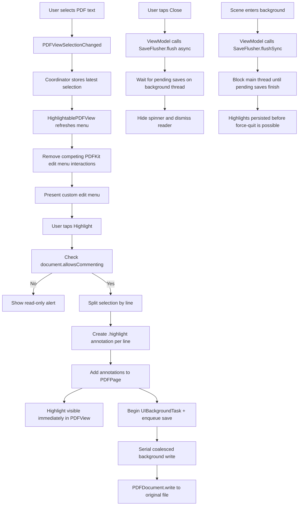

# Highlight feature in iOS

This document describes how the current iOS highlight flow works in `PDFReaderT`, based on the implementation in `PDFViewer.swift`, `PDFReaderView.swift`, and `PDFReaderViewModel.swift`.

## Overview

The highlight feature has four main parts:

1. Detect text selection changes in the PDF view.
2. Present the app's custom edit menu and add a `Highlight` action.
3. Convert the selection into PDF highlight annotations and add them to the in-memory `PDFDocument`.
4. Persist those annotation changes back to the original file using a coalesced background save pipeline, and fully flush pending writes before the reader closes.

## Text selection and menu behavior

When the user long-presses or drags to select text, `PDFViewSelectionChanged` fires. The `PDFViewer.Coordinator` captures the latest `PDFSelection` and tells `HighlightablePDFView` to refresh its menu state.

`HighlightablePDFView` does a few things to make the app's menu win consistently:

- It installs its own `UIEditMenuInteraction`.
- It recursively removes other `UIEditMenuInteraction` instances from PDFKit's internal subviews.
- It returns `false` for the private `_define:` responder action so the system "Look Up / Define" behavior does not take over.
- It presents the menu programmatically after a short delay, and retries a few times if the custom menu does not appear immediately.

The resulting menu is designed to show the normal text actions plus the app's custom `Highlight` action. In practice, the current code appends `Highlight` to UIKit's `suggestedActions`, so the intended user-facing actions are `Copy`, `Select All`, and `Highlight`, but the implementation does not hard-enforce "exactly three actions" as a strict invariant.

## Applying highlights

When the user taps `Highlight`, the view uses the latest active `PDFSelection` and passes it back to the coordinator.

The coordinator then:

1. Checks `document.allowsCommenting`. If the PDF is read-only for annotations, the app shows an alert instead of writing highlights.
2. Splits the selection with `selectionsByLine()`.
3. For each line selection, gets the line bounds on the corresponding `PDFPage`.
4. Creates a `PDFAnnotation` of type `.highlight`.
5. Sets the annotation color to `UIColor.yellow.withAlphaComponent(0.5)`.
6. Adds the annotation directly to the page.

The visual result appears immediately because the annotations are added to the live `PDFDocument` already displayed by `PDFView`. No reload from disk is required for the user to see the highlight.

## Persisting highlights to disk

Saving is handled by a dedicated `PDFSaveCoordinator`.

Its responsibilities are:

- Own a serial background queue.
- Coalesce repeated save requests using `hasPendingSave` and `isSaveRunning`.
- Keep saving logic independent from the UI coordinator, so a long-running file write can continue safely even if the view coordinator is deallocated.

Every highlight creation enqueues a save request. The `save()` method registers a `UIBackgroundTask` before dispatching to the serial queue, so the system knows to keep the app alive for the entire duration the write is queued and executing. On that queue, the coordinator:

1. Starts security-scoped access for the selected file URL.
2. Calls `PDFDocument.write(to:)`.
3. Stops security-scoped access.
4. Ends the background task.
5. If another save request arrived while the write was running, loops again and writes the latest state.

This means rapid highlight edits do not start overlapping writes, and the file eventually converges to the latest annotated document state.

## Flush strategies

The `PDFViewer.Coordinator` registers a `SaveFlusher` with the `PDFReaderViewModel` during setup. The flusher exposes two modes: an async `flush(completion:)` for UI-driven flows and a synchronous `flushSync()` for lifecycle transitions.

### Background-transition flush

When the scene phase changes to `.background`, `PDFReaderViewModel.onDidEnterBackground()` calls `saveFlusher.flushSync()`. This blocks the main thread until every pending write finishes. Because the UI is no longer visible at this point, the brief block has no user-facing impact. Critically, the background transition always fires before the user can reach the app switcher to force-quit, so highlights created moments before backgrounding are guaranteed to be persisted.

### Close-time flush and spinner

When the user taps `Close`, the view model:

1. Saves the current page position.
2. Sets `isSavingBeforeClose = true`.
3. Calls `saveFlusher.flush(...)`.

That flush waits on a background thread until all queued PDF writes have finished. While that happens:

- `PDFReaderView` shows a spinner overlay over the reader.
- The `Close` button is disabled.

Once the pending saves are fully flushed, completion returns to the main thread, the spinner disappears, and the reader is dismissed.

This close-time flush prevents a race where the UI closes before a large PDF finishes writing, which could otherwise make newly added highlights appear missing if the user reopens the file immediately.

## Flow diagram

